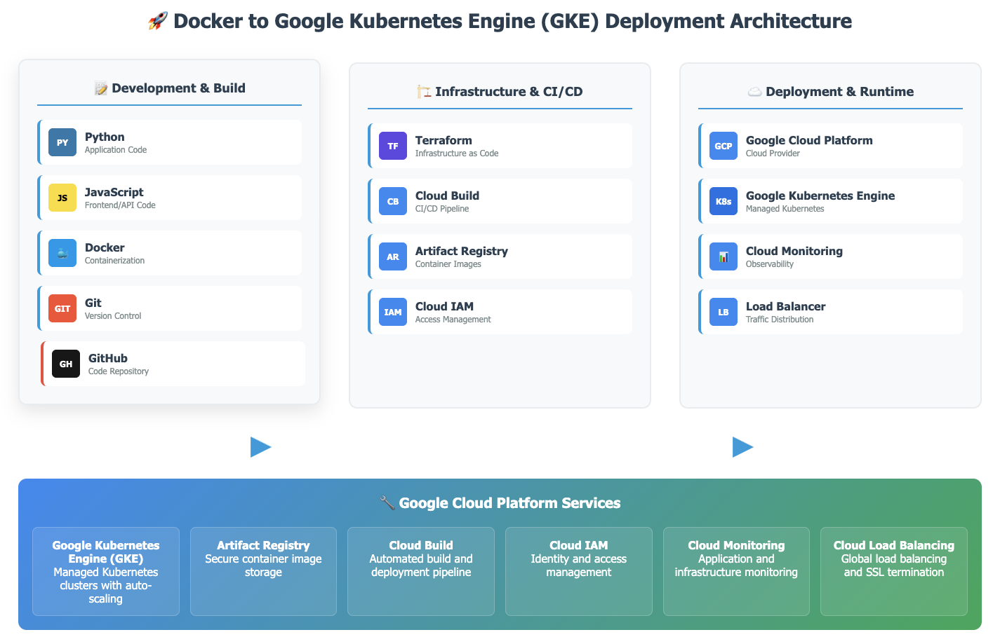

# docker-gke-deploy

Building and Deploying a Docker image to a GKE Cluster

## Summary

This playbook outlines how to build and deploy the **echo-web** sample application to a Google Kubernetes Engine (GKE) cluster named **echo-cluster** using Docker and Google Container Registry (GCR). You will first create a two-node GKE cluster with `e2-standard-2` machine types in the `us-central1-f` zone, then download and unpack the `echo-web.tar.gz` archive from Cloud Storage to build a Docker image tagged `v1`. Next, you will authenticate Docker to push the image to `gcr.io/[PROJECT_ID]/echo-app:v1`. Finally, you will deploy the application by creating a Kubernetes **Deployment** named **echo-web** (which listens on port 8000 inside the container) and expose it via a **Service** that responds on port 80 externally. Throughout, each major concept—from clustering and nodes to containerization and service port mapping—is explained step by step. ([medium.com][1], [skills.google][2], [levelup.gitconnected.com][3], [skills.google][2], [kubernetes.io][4])

Scroll down to find the 

---

## 🏗️ Architecture

View our interactive deployment architecture diagram:

**[🚀 Live Interactive Diagram](https://ovokpus.github.io/docker-gke-deploy/)**



This diagram shows the complete Docker to GKE deployment workflow including:

- Development stack (Python, JavaScript, Docker)
- Infrastructure as Code (Terraform)
- CI/CD pipeline (Cloud Build)
- GKE deployment and monitoring

---

## Playbook

### Prerequisites

1. **Google Cloud SDK Installed and Authenticated**
   Ensure the [Google Cloud SDK](https://cloud.google.com/sdk/docs/install) is installed and that you have authenticated with `gcloud auth login`. ([fusionauth.io][5], [cloud.google.com][6])
2. **Docker Installed Locally**
   Confirm that Docker is installed (`docker --version`) and the Docker daemon is running. ([mayankchourasia2.medium.com][7])
3. **kubectl Installed**
   Install `kubectl` (the Kubernetes CLI tool) and verify it’s available in your PATH (`kubectl version --client`). ([fusionauth.io][5], [kubernetes.io][4])
4. **Permissions and APIs Enabled**

   - Grant yourself `roles/container.admin`, `roles/compute.networkAdmin`, and `roles/storage.admin` in the project. ([medium.com][1])
   - Enable the GKE API:

     ```bash
     gcloud services enable container.googleapis.com
     ```

     ([medium.com][1], [skills.google][2])

   - Enable the Container Registry API:

     ```bash
     gcloud services enable containerregistry.googleapis.com
     ```

     ([skills.google][2])

---

## Step 1: Create a Kubernetes Cluster

1. **Concept: GKE Cluster and Node Pools**
   A GKE cluster is a managed Kubernetes control plane plus a set of worker nodes. Nodes run in Compute Engine VMs, and a **node pool** groups VMs of the same machine type, scaling, and auto-repair settings. Here, we will create a **zonal** cluster (control plane and nodes in a single zone) to minimize resource usage. ([medium.com][1], [vcluster.com][8])

2. **Set Default Zone (Optional)**
   You can set your default zone to `us-central1-f` so you don’t have to specify `--zone` on each command:

   ```bash
   gcloud config set compute/zone us-central1-f
   ```

   ([medium.com][1], [fig.io][9])

3. **Create the Cluster**
   Run the following command to create a cluster named `echo-cluster` with two `e2-standard-2` nodes in `us-central1-f`. Each node has 2 vCPUs and 8 GB of RAM, which is sufficient for a small test environment:

   ```bash
   gcloud container clusters create echo-cluster \
       --zone us-central1-f \
       --machine-type=e2-standard-2 \
       --num-nodes=2
   ```

   - `--zone us-central1-f`: Specifies a zonal cluster.
   - `--machine-type e2-standard-2`: Allocates 2 vCPUs and 8 GB RAM per node (cost-effective for testing).
   - `--num-nodes 2`: Deploys exactly two nodes across one node pool. ([medium.com][1], [github.com][10], [vcluster.com][8])

4. **Verify Cluster Creation**
   Cluster creation can take **10–15 minutes**. After completion, retrieve credentials for `kubectl` and list the nodes:

   ```bash
   gcloud container clusters get-credentials echo-cluster --zone us-central1-f
   kubectl get nodes
   ```

   You should see two nodes labeled with `MACHINE-TYPE= e2-standard-2` and `STATUS= Ready`. ([medium.com][1], [vcluster.com][8])

5. **Concept: Node Readiness**
   A `Ready` node indicates that the kubelet has registered itself with the control plane. Until nodes are `Ready`, the cluster cannot schedule pods. ([medium.com][1])

---

## Step 2: Build a Tagged Docker Image

1. **Concept: Dockerfile and Image Context**
   The `ech o-web.tar.gz` archive contains a `Dockerfile` and Go source code (e.g., `main.go`) that defines a simple HTTP server listening on port 8000. A Dockerfile describes how to build an image layer by layer (base OS, dependencies, application code, and startup command). ([skills.google][2], [mayankchourasia2.medium.com][7])

2. **Download the `echo-web.tar.gz` Archive**
   Replace `[PROJECT_ID]` with your actual project ID and run:

   ```bash
   gsutil cp gs://[PROJECT_ID]/echo-web.tar.gz .
   ```

   This command copies the compressed archive from Cloud Storage to your local working directory. ([skills.google][2], [cloud.google.com][6])

3. **Extract the Archive**
   Unpack the archive into the subdirectory `echo-web/`:

   ```bash
   tar -xzf echo-web.tar.gz
   ```

   Now `echo-web/` contains:

   - `Dockerfile`
   - Go source code (e.g., `main.go`)
   - Any configuration files (e.g., `go.mod`)
     ([skills.google][2], [mayankchourasia2.medium.com][7])

4. **Navigate to the Application Directory**

   ```bash
   cd echo-web
   ```

   The working directory now holds the Docker context (files referenced by the Dockerfile). ([skills.google][2], [mayankchourasia2.medium.com][7])

5. **Tagging Convention for GCR**
   Google Container Registry uses repository names in the form `gcr.io/[PROJECT_ID]/[REPO_NAME]:[TAG]`. For this lab, the repository should be `echo-app` and the tag `v1`, so the full image name is:

   ```
   gcr.io/[PROJECT_ID]/echo-app:v1
   ```

   ([skills.google][2], [github.com][11])

6. **Build the Docker Image**
   Run the Docker build command to compile your Go application, package it into a container, and tag it appropriately:

   ```bash
   docker build -t gcr.io/[PROJECT_ID]/echo-app:v1 .
   ```

   - `-t gcr.io/[PROJECT_ID]/echo-app:v1`: Tags the resulting image so you can push it directly to GCR.
   - `.`: Uses the current directory (`echo-web/`) as the build context, reading from `Dockerfile`. ([skills.google][2], [github.com][11])

7. **Verify the Local Image**
   After the build finishes, confirm that the image exists locally:

   ```bash
   docker images | grep echo-app
   ```

   Output should include a line:

   ```
   gcr.io/[PROJECT_ID]/echo-app   v1   <IMAGE_ID>   <SIZE>   <CREATED>
   ```

   ([skills.google][2], [github.com][11])

8. **Concept: Image Layers**
   Docker images are composed of layers:

   - **Base OS layer** (e.g., Alpine or Debian)
   - **Dependency layers** (e.g., installing Go runtime)
   - **Application code layer** (compiled Go binary)
   - **Configuration layer** (ENV, EXPOSE, CMD)
     Tagging the final image as `v1` makes it easier to manage subsequent versions. ([skills.google][2], [stackoverflow.com][12])

---

## Step 3: Push the Image to Google Container Registry

1. **Concept: Google Container Registry (GCR)**
   GCR is a hosted Docker image storage service tightly integrated with Google Cloud. Images pushed to GCR can be pulled by GKE, Cloud Run, or other container runtimes in your project. ([skills.google][2])

2. **Authenticate Docker with GCR**
   To allow Docker to push to `gcr.io`, run:

   ```bash
   gcloud auth configure-docker
   ```

   This command updates your `~/.docker/config.json` to use the Google Cloud credential helper for any `gcr.io` operations. ([github.com][11])

3. **Verify Credential Helper**

   ```bash
   docker info | grep gcr.io
   ```

   You should see a line like:

   ```
   gcr.io: max-login-tries = 0
   ```

   indicating that Docker will use `gcloud` auth when interacting with `gcr.io`. ([github.com][11])

4. **Push the Image**
   Run:

   ```bash
   docker push gcr.io/[PROJECT_ID]/echo-app:v1
   ```

   - Each image layer is uploaded to `gcr.io/[PROJECT_ID]/echo-app` under the `v1` tag.
   - You will see upload progress bars for each layer.
     ([skills.google][2])

5. **Verify Push Success**
   Upon completion, you should see:

   ```
   v1: digest: sha256:<DIGEST> size: <SIZE> pushed
   ```

   indicating that GCR now stores `echo-app:v1`. ([skills.google][2], [github.com][11])

6. **Confirm in Cloud Console or CLI**

   - **Console:** Go to **Container Registry** → **Images** in the Google Cloud Console. You should see a repository named `echo-app` with a `v1` tag. ([skills.google][2], [github.com][11])
   - **CLI:**

     ```bash
     gcloud container images list-tags gcr.io/[PROJECT_ID]/echo-app --limit=5
     ```

     You should see an entry for `v1` with the corresponding digest and timestamp. ([skills.google][2], [github.com][11])

7. **Concept: IAM Permissions for GCR**
   Users pushing images require `roles/storage.admin` or `roles/storage.objectAdmin` on the `artifacts.[PROJECT_ID].appspot.com` bucket (behind the scenes) or the broader `roles/container.admin`. ([community.jenkins.io][13])

---

## Step 4: Deploy the Application to the Kubernetes Cluster

### 4.1 Create the Deployment

1. **Concept: Kubernetes Deployment**
   A **Deployment** in Kubernetes ensures that a specified number of pod replicas running a given container image are always available. If a pod crashes, the Deployment controller will automatically recreate it. ([levelup.gitconnected.com][3], [linkedin.com][14])

2. **Write the Deployment Manifest**
   Create a file named `echo-web-deployment.yaml` with:

   ```yaml
   apiVersion: apps/v1
   kind: Deployment
   metadata:
     name: echo-web
   spec:
     replicas: 2
     selector:
       matchLabels:
         app: echo-web
     template:
       metadata:
         labels:
           app: echo-web
       spec:
         containers:
           - name: echo-web
             image: gcr.io/[PROJECT_ID]/echo-app:v1
             ports:
               - containerPort: 8000
   ```

   - **`apiVersion: apps/v1`** and **`kind: Deployment`**: Declares a Deployment resource.
   - **`metadata.name: echo-web`**: Names the Deployment “echo-web” as required.
   - **`replicas: 2`**: Ensures two pods are always running for basic availability.
   - **`selector.matchLabels`** and **`template.metadata.labels`**: Must match so the Deployment can manage its pods.
   - **`containers[].image`**: Specifies the container image from GCR.
   - **`ports.containerPort: 8000`**: States that the application inside listens on port 8000. ([levelup.gitconnected.com][3], [linkedin.com][14])

3. **Apply the Deployment**

   ```bash
   kubectl apply -f echo-web-deployment.yaml
   ```

   This registers the Deployment with the Kubernetes API server, and the control plane schedules two pods onto the ready nodes. ([levelup.gitconnected.com][3], [linkedin.com][14])

4. **Verify Pod Status**

   ```bash
   kubectl get pods -l app=echo-web
   ```

   You should see two pods named something like `echo-web-xxxxx` in `STATUS=Running`. ([levelup.gitconnected.com][3], [fusionauth.io][5])

5. **Inspect Pod Logs (Optional)**
   If a pod is not running, check logs:

   ```bash
   kubectl logs <pod-name>
   ```

   Confirm that the Go application started successfully and is listening on port 8000. ([levelup.gitconnected.com][3], [stackoverflow.com][12])

---

### 4.2 Expose the Deployment via a Service

1. **Concept: Kubernetes Service & LoadBalancer**
   A **Service** abstracts a set of pods and provides a fixed virtual IP.

   - **`ClusterIP`**: Accessible only inside the cluster.
   - **`NodePort`**: Exposes the service on a port on each node’s IP.
   - **`LoadBalancer`**: Provisions a cloud load balancer with an external IP, forwarding traffic to the selected pods.
     We will use type `LoadBalancer` so that external HTTP requests on port 80 forward to pods on port 8000. ([kubernetes.io][4], [levelup.gitconnected.com][3])

2. **Write the Service Manifest**
   Create a file named `echo-web-service.yaml` with:

   ```yaml
   apiVersion: v1
   kind: Service
   metadata:
     name: echo-web-service
   spec:
     selector:
       app: echo-web
     ports:
       - protocol: TCP
         port: 80
         targetPort: 8000
     type: LoadBalancer
   ```

   - **`metadata.name: echo-web-service`**: Names the Service.
   - **`spec.selector.app: echo-web`**: Selects pods with the label `app=echo-web`.
   - **`ports.port: 80`**: Exposes service on port 80 externally (standard HTTP).
   - **`ports.targetPort: 8000`**: Forwards incoming traffic to container port 8000.
   - **`type: LoadBalancer`**: Requests a cloud load balancer. ([levelup.gitconnected.com][3], [kubernetes.io][4])

3. **Apply the Service**

   ```bash
   kubectl apply -f echo-web-service.yaml
   ```

   Kubernetes will allocate an external LoadBalancer IP. You can track progress:

   ```bash
   kubectl get svc echo-web-service
   ```

   Initially, `EXTERNAL-IP` may show `<pending>`. Wait a minute until it transitions to an IP address. ([levelup.gitconnected.com][3], [kubernetes.io][4])

4. **Verify Endpoints**
   Check that the Service endpoints match the pods:

   ```bash
   kubectl describe svc echo-web-service
   ```

   Under `Endpoints:`, you should see two entries like `10.128.0.5:8000,10.128.0.6:8000`, corresponding to your two pods. ([fusionauth.io][5], [kubernetes.io][4])

5. **Test Application Access**

   - **Inside the Cluster:**
     Retrieve one pod’s IP and port to confirm the app is running:

     ```bash
     POD_IP=$(kubectl get pods -l app=echo-web -o jsonpath='{.items[0].status.podIP}')
     curl http://$POD_IP:8000
     ```

     You should receive a JSON or plaintext response with system information. ([levelup.gitconnected.com][3], [stackoverflow.com][12])

   - **Externally via LoadBalancer:**
     Copy the `EXTERNAL-IP` (e.g., `34.123.45.67`) from:

     ```bash
     kubectl get svc echo-web-service --output=jsonpath='{.status.loadBalancer.ingress[0].ip}'
     ```

     Then run:

     ```bash
     curl http://34.123.45.67
     ```

     You should see the same echo output, confirming that port 80 is forwarding to port 8000 on the pods. ([levelup.gitconnected.com][3], [kubernetes.io][4])

---

## Concepts Covered

- **Cluster Basics:**
  Creating a GKE cluster provisions a Kubernetes control plane (managed by Google) and worker nodes (Compute Engine VMs). Nodes are grouped into node pools, and you can choose machine types like `e2-standard-2` for balanced CPU/memory. ([medium.com][1], [vcluster.com][8])

- **Docker Image Build Process:**
  The Dockerfile defines a sequence of instructions to assemble a container image. Each instruction creates a new read-only layer (e.g., `FROM`, `RUN go build`, `COPY`). Tagging with `v1` enables versioning and rollbacks. ([skills.google][2], [mayankchourasia2.medium.com][7])

- **Container Registry (GCR):**
  GCR is a managed Docker registry that stores and serves container images within a Google Cloud project. Using `gcloud auth configure-docker` integrates Docker’s CLI with Google IAM for secure pushes/pulls. ([skills.google][2])

- **Kubernetes Deployment and Pods:**
  A Deployment ensures that a specified number of pod replicas are running and automatically replaces failed pods. The pod template includes the container image and the port on which the application inside listens. ([levelup.gitconnected.com][3], [linkedin.com][14])

- **Kubernetes Service Types & Port Mapping:**
  A Service with `type: LoadBalancer` allocates a cloud load balancer and provides an external IP. It exposes port 80 externally and forwards to `targetPort: 8000` inside the pod. This decouples external port requirements from the container’s internal port. ([kubernetes.io][4], [levelup.gitconnected.com][3])

---

## Troubleshooting

- **Cluster Creation Errors:**

  - If `gcloud container clusters create` fails with “default network not found,” run `gcloud compute networks create default`. ([github.com][10], [medium.com][1])
  - If GKE reports more nodes than expected, ensure you didn’t specify multiple zones under `--node-locations`. ([stackoverflow.com][15], [stackoverflow.com][16])

- **Docker Build Failures:**

  - If `docker build` is killed due to lack of memory, try increasing VM disk or memory, or use a smaller base image (e.g., `alpine`). ([stackoverflow.com][12])
  - Check for syntax errors in the Dockerfile or missing files in the build context. ([stackoverflow.com][12], [skills.google][2])

- **Docker Push Authentication Errors:**

  - If `docker push` yields `denied: Permission denied`, re-run `gcloud auth configure-docker` and confirm IAM roles (`roles/storage.admin`). ([community.jenkins.io][13])

- **Pods CrashLoopBackOff:**

  - Inspect pod logs with `kubectl logs <pod-name>`.
  - Verify the container listens on port 8000 (as declared in `containerPort`). ([levelup.gitconnected.com][3], [stackoverflow.com][12])

- **Service `<pending>` IP for Long Time:**

  - Check project quota for external IP addresses (`gcloud compute project-info describe --project=[PROJECT_ID]`).
  - Ensure your cluster’s subnet has available IPs for a load balancer. ([kubernetes.io][4], [github.com][11])

---

## Next Steps

1. **Scale the Deployment**
   Increase replicas manually or implement autoscaling:

   ```bash
   kubectl scale deployment echo-web --replicas=4
   kubectl autoscale deployment echo-web --cpu-percent=50 --min=2 --max=10
   ```

   Autoscaling adjusts the number of pods based on CPU usage. ([medium.com][1], [levelup.gitconnected.com][3])

2. **Implement CI/CD**
   Use Cloud Build or GitHub Actions to automate:

   - Docker build and tag (e.g., `v2`)
   - Push to GCR
   - Update Kubernetes Deployment (`kubectl set image deployment/echo-web echo-web=gcr.io/[PROJECT_ID]/echo-app:v2`)
   - Roll back on failure. ([stackoverflow.com][17], [community.jenkins.io][13])

3. **Enable TLS and Domain Mapping**

   - Create a Managed SSL certificate and use an Ingress resource to terminate HTTPS on port 443.
   - Map a custom domain to the LoadBalancer’s external IP. ([levelup.gitconnected.com][3], [fusionauth.io][5])

4. **Monitor and Logging**

   - Enable Stackdriver (Cloud Monitoring) to track CPU/memory usage.
   - Use Cloud Logging to aggregate application logs from pods for troubleshooting. ([medium.com][1], [levelup.gitconnected.com][3])

5. **Security Best Practices**

   - Use a minimal base image (e.g., `gcr.io/distroless/base`) to reduce attack surface.
   - Implement Binary Authorization to enforce signed container images. ([community.jenkins.io][13])

---

By following this playbook, you have:

- Created a cost-efficient two-node GKE cluster named **echo-cluster**.
- Built and tagged a Docker image (`echo-app:v1`) from the `echo-web` Go application.
- Pushed the image to Google Container Registry under `gcr.io/[PROJECT_ID]/echo-app:v1`.
- Deployed the application to Kubernetes as a **Deployment** named **echo-web** and exposed it via a **Service** listening on port 80 (targeting port 8000 in the container).

This end-to-end workflow lays the foundation for containerized microservices development and paves the way for CI/CD integration, autoscaling, and production readiness.

[1]: https://medium.com/%40yakheng/optimize-costs-for-google-kubernetes-engine-challenge-lab-9176ee0c7821?utm_source=chatgpt.com "Optimize Costs for Google Kubernetes Engine: Challenge Lab"
[2]: https://www.skills.google/paths/126/course_templates/640/labs/489767?utm_source=chatgpt.com "Build and Deploy a Docker Image to a Kubernetes Cluster ..."
[3]: https://levelup.gitconnected.com/build-and-deploy-a-docker-image-to-a-kubernetes-cluster-gcp-7e2c43566d35?utm_source=chatgpt.com "Build and Deploy a Docker Image to a Kubernetes Cluster-GCP"
[4]: https://kubernetes.io/docs/reference/kubectl/generated/kubectl_expose/?utm_source=chatgpt.com "kubectl expose - Kubernetes"
[5]: https://fusionauth.io/docs/get-started/download-and-install/kubernetes/gke?utm_source=chatgpt.com "Provision a Google Kubernetes Engine (GKE) Kubernetes Cluster"
[6]: https://cloud.google.com/kubernetes-engine/docs/how-to/creating-a-regional-cluster?utm_source=chatgpt.com "Creating a regional cluster | Google Kubernetes Engine (GKE)"
[7]: https://mayankchourasia2.medium.com/build-and-deploy-a-docker-image-to-a-kubernetes-cluster-380edab69f8f?utm_source=chatgpt.com "Build and Deploy a Docker Image to a Kubernetes Cluster"
[8]: https://www.vcluster.com/docs/vcluster/deploy/environment/gke?utm_source=chatgpt.com "Deploy on GKE | vCluster docs | Virtual Clusters for Kubernetes"
[9]: https://fig.io/manual/gcloud/container/clusters/create?utm_source=chatgpt.com "gcloud container clusters create <NAME> - Fig.io"
[10]: https://github.com/GoogleCloudPlatform/gke-networking-recipes/blob/main/cluster-setup.md?utm_source=chatgpt.com "gke-networking-recipes/cluster-setup.md at main - GitHub"
[11]: https://github.com/elmoallistair/qwiklabs/blob/master/labs/gsp304_build-and-deploy-a-docker-image-to-a-kubernetes/script.sh?utm_source=chatgpt.com "juaragcp/labs/gsp304_build-and-deploy-a-docker-image-to ... - GitHub"
[12]: https://stackoverflow.com/questions/62669720/process-got-killed-when-building-docker-image-on-gcp?utm_source=chatgpt.com "Process got killed when building docker image on GCP"
[13]: https://community.jenkins.io/t/push-to-google-artifact-registry-through-jenkins-pipeline/7868?utm_source=chatgpt.com "Push to Google Artifact Registry through Jenkins Pipeline"
[14]: https://www.linkedin.com/pulse/gcp-build-deploy-docker-image-kubernetes-cluster-vamsi-cherukuri?utm_source=chatgpt.com "GCP: Build and Deploy a Docker Image to a Kubernetes Cluster"
[15]: https://stackoverflow.com/questions/62548469/gcp-kubernetes-created-6-nodes-when-num-nodes-was-set-to-2?utm_source=chatgpt.com "GCP Kubernetes created 6 nodes when num-nodes was set to 2"
[16]: https://stackoverflow.com/questions/66993899/why-did-gcp-give-me-6-nodes-when-i-asked-for-2?utm_source=chatgpt.com "Why did GCP give me 6 nodes when I asked for 2? - Stack Overflow"
[17]: https://stackoverflow.com/questions/62665625/how-to-perform-kaniko-docker-build-and-push-in-separate-gitlab-ci-stages?utm_source=chatgpt.com "How to perform kaniko Docker build and push in separate GitLab CI ..."

# Echo application example

This example can be used to demonstrate how to build and deploy a containerized Go web server
application with [Kubernetes](https://kubernetes.io).

This directory contains:

- `main.go` contains the HTTP server implementation that responds to requests with inforamtion
- about the service responding to the request.
- `Dockerfile` is used to build the Docker image for the application and simply compiles all go files
- in the current directory to an application called echo-app.
- The Dockerfile is configured by default to configure the app to use port 8000 for the http listener service

- [Kubernetes Engine Quickstart](https://cloud.google.com/kubernetes-engine/docs/quickstart)
